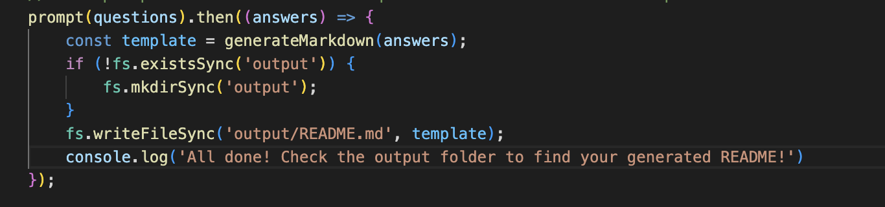
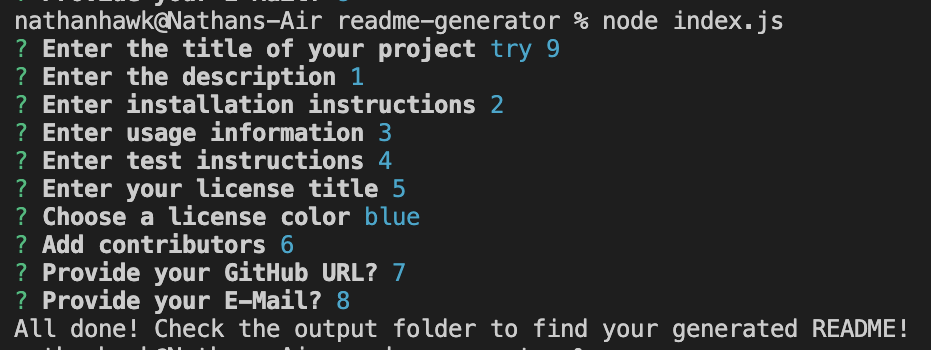

# readme-generator

## Description
This code allows to run a series of prompts which ask for specific details per your project, and then creates a README file and fills it with the information that was inputted.

Link to recording demo: 

## Table of  
1. [Installation](#Installation)
2. [Usage](#Usage)
3. [Visuals](#Visuals)

## Installation
For installation, inquirer version 8.2.4 is required, as well as fs. To install, simply run npm install after cloning repo.

## Usage
The usage for this allows for easy generation of READMEs for any project you are working on.

## Visuals 

This photo is from index.js which is the main prompt function that asks all the prompts, creates an output folder if there isn't one, and finally creates a Markdown page using all the values that were submitted from the console.

This photo shows a sample of all the questions that are asked and the value that you entered.